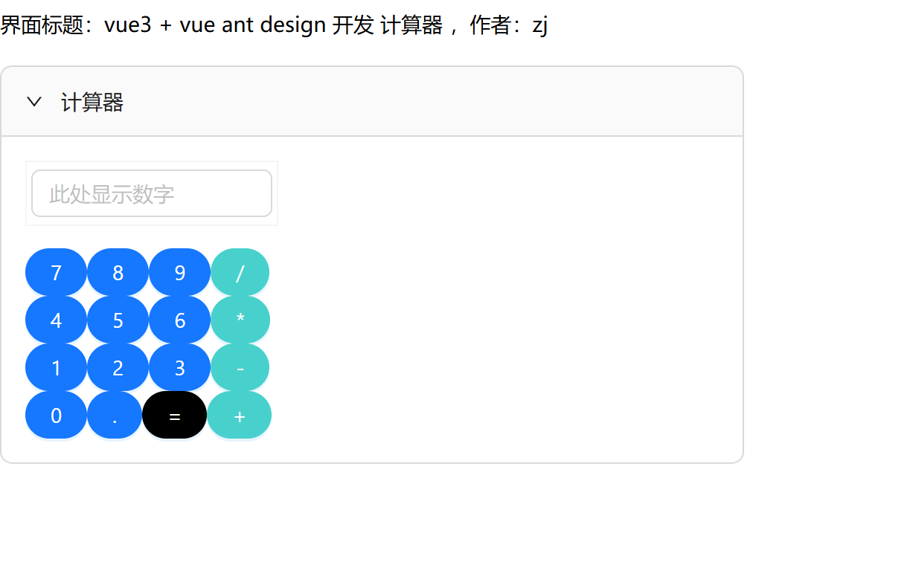
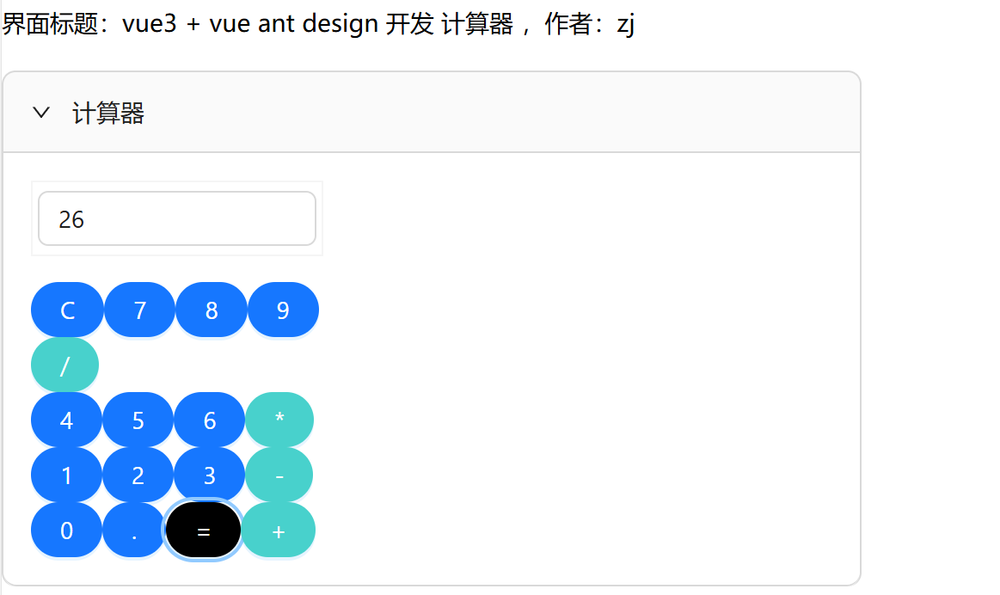
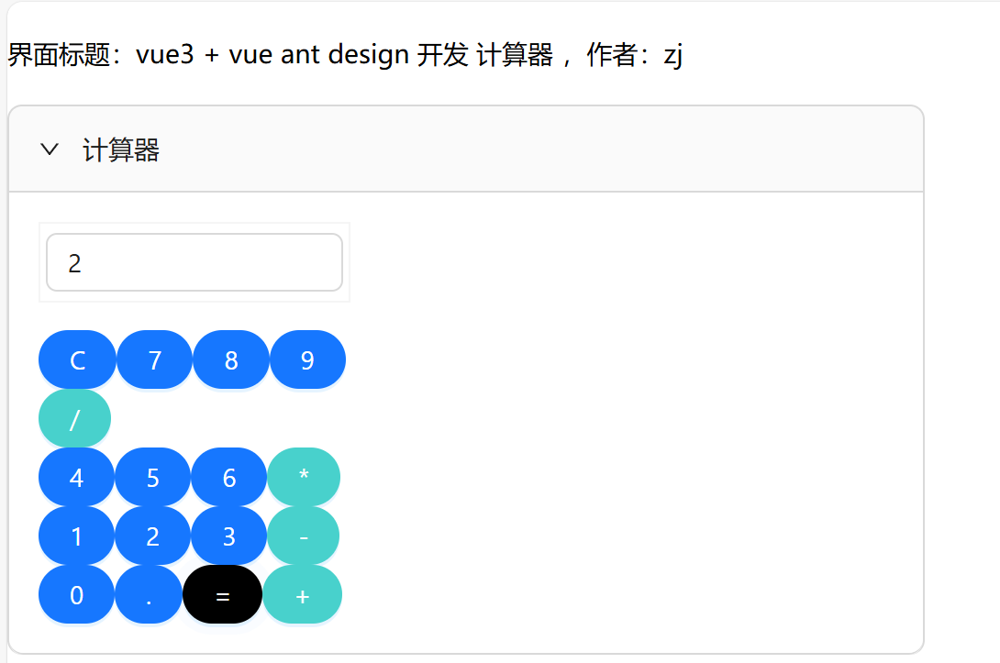
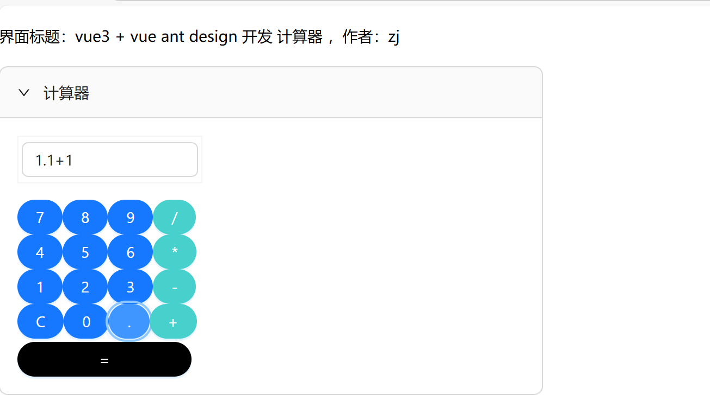
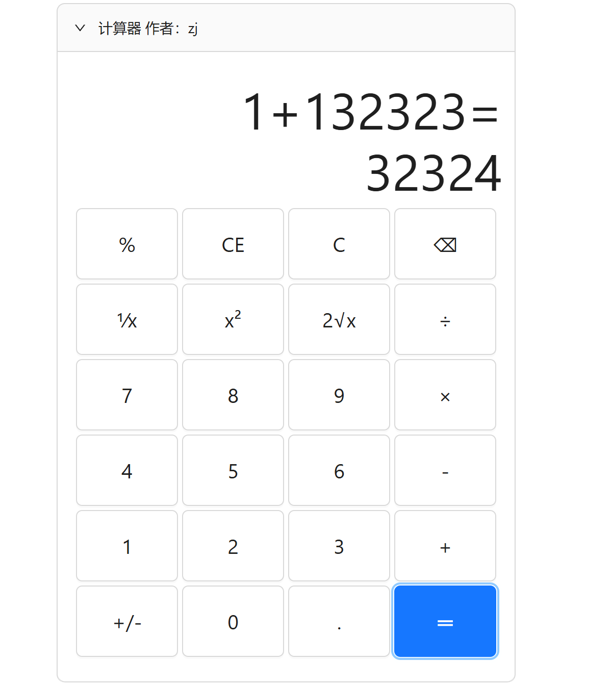

# my-vue-project

## 项目开始
```
npm install // 安装项目依赖

npm run serve // 运行项目

npm run build // 打包项目

npm run lint // 检查项目

Customize configuration // 自定义配置
查看： https://cli.vuejs.org/config/
```

## 开发计划

**使用的技术栈：**
+ vue 3.2.13
+ ant design vue 4.2.6
+ typescript 5.7.3
+ java spring boot  
+ mysql(还没开始) 
+ github 源码管理
+ markdown 技术文档编写 

### 2025-02-20
. 1 完成 ts 的环境开发 【已完成】 
> 总结：环境有点复杂，相关问题笔记已记录在文档[Doc.md](Doc.md)

\
. 2 完成 vue  ts语法  ant design 的计算器开发 【完成50%】
> 总结：今天只完成了界面的显示效果，界面上还可以重新调整布局或布局写法，但是不重要。明天要完成计算功能。 


### 2025-02-21
.1完成ant design的计算器开发
\
出现bug：
>ant design的折叠样式不显示
https://github.com/zjusername/vuedemo1/issues/2
ant design的input【已完成bug修复】
无法更新inputValue.value的值【已完成bug修复】
\
总结：今天只完成了，界面的显示效果，界面上的input可以使用，明天需要完成计算功能。

### 2025-02-22
无更新

## 2025-02-23
1.完成计算功能 【已完成】
\
2.完成小数点计算【已完成】
\
出现bug:

计算完成之后在按等于符号，就累加后面就的值【已完成bug修复】
例如：
1+1=2，在按等于符号后，就累加后面的值
\
bug2:
更改全部显示数值后,计算1+2时等于2【已完成bug修复】
.png)


## 2025-02-24
1.完成与前后端加减乘交互【已完成】
\
2.完成小数点加减乘【已完成】
\
3.完成前端加减计算 【未完成】
>出现bug:
被加数点击小数点后，加数就点击不了小数点了【已修复】

第二个值的显示第一个字符删不掉【未修复】


## 2025-02-24
1.解决昨天未完成bug【已完成】
\
2.实现连加功能【已完成】
>目前只能实现加减功能

## 2025-02-24
1.修复文本框内容超出的问题
\